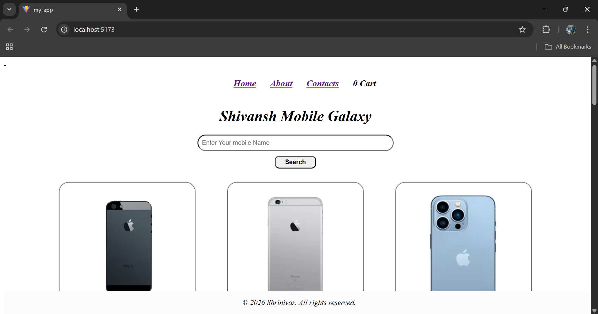

# Shivansh Mobile Gallery

A modern **React** web application for browsing and exploring mobile phones. This project demonstrates React components, React Router, Redux for cart management, lazy loading, API fetching, and responsive design.

---

## **Features**

- Browse a list of mobile phones with images, ratings, and prices.
- View detailed information for each mobile.
- Search for mobiles by name.
- Add and remove mobiles from the cart using **Redux**.
- Responsive design for desktop and mobile screens.
- Lazy loading for better performance.
- Error page for invalid routes.

---

## **Technologies Used**

- **React** (Functional Components, Hooks)
- **React Router v6** (Dynamic routing, Suspense, Lazy Loading)
- **Redux Toolkit** (Cart state management)
- **CSS** (Flexbox, Media Queries)
- **JavaScript** (ES6+)
- **Fetch API** for data fetching

---

## **Folder Structure**

SCREENSHOT :    